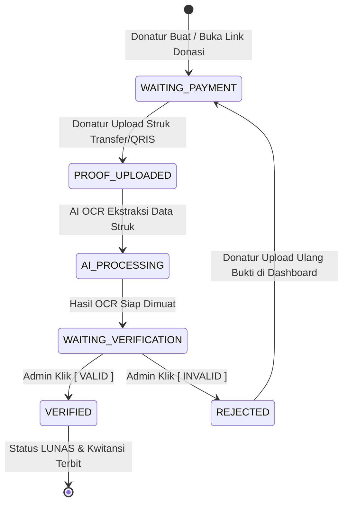

# SPESIFIKASI IMPLEMENTASI SISTEM
## AI-Assisted QRIS Payment & Donation Verification System (`payVerify`)

---

## 1. PENDAHULUAN & ARSITEKTUR SISTEM

### 1.1 Visi Produk
`payVerify` adalah platform verifikasi transaksi pembayaran dan donasi berbasis **AI / OCR (Optical Character Recognition)**. Sistem ini dirancang efisien dan mudah digunakan oleh **Admin** (Pengelola / Verifikator) serta **Customer / Donatur** (Pengguna yang melakukan pembayaran/donasi dan melacak status verifikasinya).

### 1.2 Prinsip Utama: Human-in-the-Loop (HITL)
* **AI sebagai Asisten Ekstraksi & Analisis**: AI/OCR bertugas membaca teks bukti transfer/QRIS, mengekstraksi nominal, tanggal, waktu, provider bank/e-wallet, serta menghitung *confidence score* dan indikator *risk level*.
* **Keputusan Akhir Mutlak oleh Manusia**: AI **TIDAK PERNAH** mengubah status pembayaran secara otomatis. Keputusan akhir (`VALID` / `INVALID`) wajib dieksekusi oleh **Admin**.

### 1.3 Penyederhanaan Role & Arsitektur Fleksibel
Untuk menjaga aplikasi tetap fokus, intuitif, dan tidak berlebihan (*over-engineered*), sistem menyederhanakan tingkatan hak akses menjadi **2 Role Utama**:
1. **Admin / Verifikator**: Mengelola transaksi/donasi, QRIS, verifikasi bukti pembayaran, dan laporan.
2. **Customer / Donatur**: Pengguna yang dapat **login** untuk mengunggah bukti pembayaran/donasi, **melacak status verifikasi secara real-time**, serta melihat riwayat total donasi/kontribusi mereka.

---

## 2. DATABASE SCHEMA & SKEMA RELASI (ERD)

Sistem menggunakan database relasional (MySQL / PostgreSQL). Skema dirancang mendukung keterkaitan transaksi dengan akun Donatur / Customer:

```mermaid
erDiagram
    users ||--o{ invoices : "creates / owns (as customer/donor)"
    businesses ||--o{ users : "has many"
    businesses ||--o{ invoices : "has many"
    businesses ||--o{ payments : "has many"
    businesses ||--o{ audit_logs : "has many"
    invoices ||--o{ payments : "has many"
    payments ||--o1 payment_proofs : "has one"
    payment_proofs ||--o1 payment_extractions : "has one"
    payment_proofs ||--o1 payment_validation_results : "has one"
    payment_proofs ||--o1 payment_risk_assessments : "has one"
    payment_proofs ||--o1 payment_verifications : "has one"
```

### 2.1 Detail Struktur Tabel Database

#### 1. `users`
| Field | Tipe Data | Constraints | Deskripsi |
| :--- | :--- | :--- | :--- |
| `id` | BIGINT | PRIMARY KEY, AUTO_INCREMENT | ID unik pengguna |
| `business_id` | BIGINT | FOREIGN KEY (`businesses.id`), NULLABLE | Tenant ID (Nullable jika Customer umum) |
| `name` | VARCHAR(255) | NOT NULL | Nama lengkap pengguna |
| `email` | VARCHAR(255) | UNIQUE, NOT NULL | Email login |
| `password` | VARCHAR(255) | NOT NULL | Hash password Bcrypt |
| `role` | VARCHAR(50) | NOT NULL | Role (`ADMIN`, `DONOR`) |
| `phone` | VARCHAR(50) | NULLABLE | Nomor WhatsApp / Telepon |
| `status` | VARCHAR(50) | DEFAULT 'ACTIVE' | Status akun (`ACTIVE`, `INACTIVE`) |
| `created_at` / `updated_at` | TIMESTAMP | DEFAULT CURRENT_TIMESTAMP | Metadata timestamp |

#### 2. `businesses` (Tenants / Pengelola Donasi)
| Field | Tipe Data | Constraints | Deskripsi |
| :--- | :--- | :--- | :--- |
| `id` | BIGINT | PRIMARY KEY, AUTO_INCREMENT | ID unik merchant / yayasan |
| `name` | VARCHAR(255) | NOT NULL | Nama Usaha / Lembaga |
| `slug` | VARCHAR(255) | UNIQUE, NOT NULL | Slug URL unik |
| `email` | VARCHAR(255) | UNIQUE, NOT NULL | Email resmi |
| `qris_image_path` | VARCHAR(255) | NULLABLE | Gambar QRIS Statis |
| `status` | VARCHAR(50) | DEFAULT 'ACTIVE' | Status tenant |

#### 3. `invoices` (Transaksi Pembayaran / Donasi)
| Field | Tipe Data | Constraints | Deskripsi |
| :--- | :--- | :--- | :--- |
| `id` | BIGINT | PRIMARY KEY, AUTO_INCREMENT | ID unik invoice/donasi |
| `business_id` | BIGINT | FOREIGN KEY (`businesses.id`) | Tenant ID |
| `user_id` | BIGINT | NULLABLE, FOREIGN KEY (`users.id`) | ID Donatur/Customer (jika login) |
| `invoice_number` | VARCHAR(100) | UNIQUE, NOT NULL | Kode transaksi (`INV-20260903-001`) |
| `customer_name` | VARCHAR(255) | NOT NULL | Nama pelanggan / donatur |
| `customer_email` | VARCHAR(255) | NULLABLE | Email donatur |
| `amount` | DECIMAL(15,2) | NOT NULL | Nominal tagihan / donasi |
| `description` | TEXT | NULLABLE | Deskripsi donasi / program / produk |
| `status` | VARCHAR(50) | DEFAULT 'WAITING_PAYMENT' | Status (`WAITING_PAYMENT`, `PAID`, `EXPIRED`, `CANCELLED`) |

#### 4. `payments`
| Field | Tipe Data | Constraints | Deskripsi |
| :--- | :--- | :--- | :--- |
| `id` | BIGINT | PRIMARY KEY, AUTO_INCREMENT | ID unik pembayaran |
| `business_id` | BIGINT | FOREIGN KEY (`businesses.id`) | Tenant ID |
| `invoice_id` | BIGINT | FOREIGN KEY (`invoices.id`) | Invoice/Donasi terkait |
| `payment_code` | VARCHAR(100) | UNIQUE, NOT NULL | Kode transaksi internal |
| `amount` | DECIMAL(15,2) | NOT NULL | Nominal terbayar |
| `payment_method` | VARCHAR(50) | DEFAULT 'QRIS' | Metode (`QRIS`, `TRANSFER_BANK`) |
| `status` | VARCHAR(50) | DEFAULT 'PENDING' | Status workflow |

#### 5. `payment_proofs`
| Field | Tipe Data | Constraints | Deskripsi |
| :--- | :--- | :--- | :--- |
| `id` | BIGINT | PRIMARY KEY, AUTO_INCREMENT | ID unik bukti pembayaran |
| `payment_id` | BIGINT | FOREIGN KEY (`payments.id`) | Pembayaran terkait |
| `file_path` | VARCHAR(255) | NOT NULL | Path penyimpanan file |
| `file_hash` | VARCHAR(64) | NOT NULL, INDEX | SHA-256 Hash (Cegah Duplikat Struk) |
| `mime_type` | VARCHAR(100) | NOT NULL | Format file gambar |
| `uploaded_at` | TIMESTAMP | DEFAULT CURRENT_TIMESTAMP | Waktu diunggah |

#### 6. `payment_extractions` (AI OCR Data)
| Field | Tipe Data | Constraints | Deskripsi |
| :--- | :--- | :--- | :--- |
| `id` | BIGINT | PRIMARY KEY, AUTO_INCREMENT | ID ekstraksi OCR |
| `payment_proof_id` | BIGINT | FOREIGN KEY (`payment_proofs.id`) | Bukti terkait |
| `raw_ocr_text` | TEXT | NULLABLE | Teks mentah terbaca |
| `extracted_amount` | DECIMAL(15,2) | NULLABLE | Nominal terdeteksi AI |
| `extracted_date` | DATE | NULLABLE | Tanggal transaksi |
| `extracted_provider` | VARCHAR(100) | NULLABLE | Bank/E-Wallet (BCA, GoPay, OVO, dll) |
| `extracted_ref_number` | VARCHAR(100) | NULLABLE | Nomor referensi/RRN |
| `confidence_score` | FLOAT | NULLABLE | Skor kepercayaan AI (0.00 - 1.00) |

#### 7. `payment_verifications` (Keputusan Admin)
| Field | Tipe Data | Constraints | Deskripsi |
| :--- | :--- | :--- | :--- |
| `id` | BIGINT | PRIMARY KEY, AUTO_INCREMENT | ID verifikasi |
| `payment_id` | BIGINT | FOREIGN KEY (`payments.id`) | Pembayaran terkait |
| `user_id` | BIGINT | FOREIGN KEY (`users.id`) | ID Admin verifikator |
| `decision` | VARCHAR(20) | NOT NULL | Keputusan (`VALID`, `INVALID`) |
| `rejection_reason` | TEXT | NULLABLE | Alasan wajib jika `INVALID` |
| `notes` | TEXT | NULLABLE | Catatan opsional jika `VALID` |
| `verified_at` | TIMESTAMP | DEFAULT CURRENT_TIMESTAMP | Waktu verifikasi |

---

## 3. STRUCTURAL ROLE & MATRIKS HAK AKSES MENU (RBAC)

Struktur peran dibuat ringkas menjadi **2 Role Utama**:

1. **ADMIN**
   * Berfungsi penuh mengelola sistem, membuat invoice/donasi, mengonfigurasi QRIS, mengeksekusi verifikasi bukti transfer/QRIS via **Workbench HITL**, dan mengunduh laporan.
2. **CUSTOMER / DONATUR**
   * Berfungsi sebagai pengguna publik/terdaftar yang dapat **login**, melakukan pembayaran/donasi, mengunggah bukti transfer/QRIS, serta **melacak riwayat dan status verifikasi donasi mereka** secara mandiri.

### 3.1 Matriks Perizinan Akses (Role Access Matrix)

| Fitur / Modul Akses | Role ADMIN | Role CUSTOMER / DONATUR |
| :--- | :---: | :---: |
| **Login / Register Portal** | **Akses Full** | **Akses Full** |
| **Dashboard Utama** | **Dashboard Admin** (Metrik Transaksi & Verifikasi) | **Dashboard Donatur** (Tracking Donasi Saya) |
| **Buat Transaksi / Donasi Baru** | **CRUD** | **Create** (Pilih Nominal & Program) |
| **Upload Bukti Transfer / QRIS** | View | **Upload & Re-upload** |
| **Tracking Status Verifikasi Real-time** | View All Queue | **Tracking Donasi Milik Sendiri** |
| **Workbench Verifikasi (HITL AI)** | **FULL (Setuju / Tolak)** | No Access (Hanya melihat status akhir) |
| **Riwayat & Cetak Kwitansi Donasi** | View All | **Download Kwitansi Donasi Saya** |
| **Pengaturan QRIS Toko / Merchant** | **CRUD** | No Access |

---

### 3.2 Detail Menu Akses per Role

#### A. Role: ADMIN (Pengelola & Verifikator)
* **Tujuan**: Memastikan semua pembayaran/donasi terverifikasi dengan cepat dan akurat.
* **Menu Akses**:
  1. **Dashboard Admin**:
     * Ringkasan total transaksi hari ini, antrean bukti menunggu verifikasi, total nominal tervalidasi, dan grafik tren mingguan.
  2. **Workbench Verifikasi Pembayaran (FITUR UTAMA)**:
     * Antrean bukti pembayaran real-time.
     * Fitur komparasi *split-screen*: Preview Struk vs Hasil Pembacaan AI OCR.
     * Indikator *Risk Assessment* (LOW / MEDIUM / HIGH) & Peringatan Duplikasi Struk.
     * Tombol **[ SETUJU / VALID ]** dan **[ TOLAK / INVALID ]** (wajib memilih/isi alasan penolakan).
  3. **Manajemen Donasi & Invoice**:
     * Membuat link pembayaran/donasi baru dan membagikannya ke WhatsApp/Sosmed.
     * Mengatur status expired invoice.
  4. **Pengaturan QRIS & Lembaga**:
     * Mengunggah foto Kode QRIS resmi & mengatur rekening tujuan.
  5. **Laporan & Audit Log**:
     * Mengunduh rekap transaksi (CSV/PDF) dan memantau log aktivitas verifikasi.

#### B. Role: CUSTOMER / DONATUR
* **Tujuan**: Memberikan transparansi penuh bagi donatur/pelanggan untuk melakukan donasi dan memantau status verifikasi pembayaran mereka.
* **Menu Akses**:
  1. **Halaman Portal Donasi / Payment Link**:
     * Melihat detail tagihan/program donasi, QRIS merchant, dan formulir pengunggahan bukti pembayaran.
  2. **Dashboard Donatur Saya (`/donor/dashboard`)**:
     * **Statistik Donasi Saya**: Total akumulasi donasi yang disetorkan dan jumlah transaksi yang sukses terverifikasi.
     * **Daftar & Tracking Status Donasi**:
       * Menampilkan tabel riwayat donasi pengguna dengan *Status Badge Real-Time*:
         * 🟡 `Diproses AI`: Struk telah diunggah dan sedang dianalisis OCR.
         * 🔵 `Menunggu Verifikasi Admin`: Data OCR selesai, menunggu persetujuan Admin/Kasir.
         * 🟢 `Terverifikasi Lunas`: Pembayaran dinyatakan VALID oleh Admin.
         * 🔴 `Ditolak`: Pembayaran INVALID. Menampilkan alasan (misal: "Nominal tidak sesuai struk") dan tombol **[ Upload Ulang Bukti ]**.
     * **Fitur Download Kwitansi / Struk Digital**:
       * Donatur dapat mengunduh bukti tanda terima donasi resmi berbentuk PDF yang sah setelah status `VALID`.
  3. **Pengaturan Profil Donatur**:
     * Mengubah nama, email, dan nomor WhatsApp untuk pengiriman notifikasi status donasi.

---

## 4. DESAIN FRONT-END & DETAIL HALAMAN (PAGE-BY-PAGE SPECIFICATION)

Antarmuka menggunakan **Modern Dark/Light Glassmorphism Theme**, *mobile-friendly*, dan responsif.

---

### GROUP A: HALAMAN CUSTOMER & DONATUR

#### 1. `P-01`: Portal Login & Registrasi Donatur / Customer (`/login` & `/register`)
* **UI Components**:
  * Tab Switcher: `[ Login ]` / `[ Daftar Akun Donatur ]`.
  * Form Field: Email, Password, Nama Lengkap, Nomor WhatsApp.
  * Tombol `[ Masuk ke Akun ]` & SSO Google Login.

#### 2. `P-02`: Portal Pembayaran / Donasi & Upload Struk (`/pay/{invoice_number}`)
* **UI Components**:
  * Summary Donasi: Nama Program/Invoice, Tanggal, Nominal Tagihan (Font Tebal).
  * Container QRIS Statis: Gambar QRIS dengan tombol `[ Salin Nominal ]` & `[ Simpan QRIS ]`.
  * Upload Dropzone Container: Drag & Drop file struk transfer (Mendukung Kamera HP).
  * Tombol Action: `[ Kirim Bukti Pembayaran ]`.

#### 3. `P-03`: Dashboard Donatur - Tracking Donasi Saya (`/donor/dashboard`)
*(Halaman Pengalaman Pelanggan / Donatur)*

* **UI Components**:
  * **Donor Impact Card Summary**: Total Kontribusi Donasi (Rp 1.500.000), Total Transaksi (5 Donasi Terverifikasi).
  * **Live Status Tracker Timeline**:
    ```text
    Invoice #INV-20260903-088 | Donasi Tanggap Bencana | Rp 250.000
    [✓] Bukti Diunggah  -->  [✓] Analisis AI Selesai  -->  [🟢 TERVERIFIKASI LUNAS]
    Action: [ Download Kwitansi PDF ]
    ```
  * **Tabel Riwayat Donasi**: List seluruh donasi terdahulu beserta status badge warna (`Diproses AI`, `Menunggu Admin`, `Terverifikasi`, `Ditolak`).

```
+-----------------------------------------------------------------------------------+
| DASHBOARD DONATUR SAYA                                            [ Akun: Ahmad ] |
+-----------------------------------------------------------------------------------+
| TOTAL DONASI SAYA: Rp 1.500.000  | TOTAL VERIFIKASI SUKSES: 5 Transaksi          |
+-----------------------------------------------------------------------------------+
| RIWAYAT & TRACKING STATUS DONASI:                                                 |
+-----------------------------------------------------------------------------------+
| Tanggal    | Program Donasi      | Nominal    | Status Real-Time       | Akses    |
|------------|---------------------|------------|------------------------|----------|
| 03/09/2026 | Beasiswa Pendidikan | Rp 500.000 | 🟢 Terverifikasi Lunas  | [Kwitansi|
| 02/09/2026 | Renovasi Masjid     | Rp 250.000 | 🔵 Menunggu Verifikasi | [Detail] |
| 28/08/2026 | Donasi Panti Asuhan | Rp 100.000 | 🔴 Ditolak (Buram)     | [Re-upload
+-----------------------------------------------------------------------------------+
```

---

### GROUP B: HALAMAN ADMIN (PENGELOLA & VERIFIKATOR)

#### 4. `A-01`: Dashboard Admin (`/admin/dashboard`)
* **UI Components**:
  * Stat Cards: Total Transaksi, Antrean Verifikasi Hari Ini (Highlight Oranye), Total Terverifikasi (Hijau), Ditolak (Merah).
  * Grafik Tren Donasi/Pembayaran Harian.
  * Tombol Pintas: `[ + Buat Donasi/Invoice ]`, `[ Buka Workbench Verifikasi ]`.

---

#### 5. `A-02`: Workbench Verifikasi Pembayaran (Human-in-the-Loop AI Center)
*(Pusat Kerja Admin Verifikator - Split Screen Viewer)*

* **UI Components**:
  * **Kolom Kiri (Image Proof Viewer)**:
    * Zoom In (+), Zoom Out (-), Rotate 90°, Mode Kontras Tinggi untuk teks buram.
    * Metadata File (Nama File, Ukuran, SHA-256 Hash duplikasi).
  * **Kolom Kanan (AI OCR & Komparasi Engine)**:
    * Badge Risk Assessment: `LOW Risk (98% Match)`, `HIGH Risk (Terindikasi Duplikat)`.
    * Tabel Perbandingan Side-by-Side:
      * Nominal Expected (Rp 250.000) vs Nominal OCR AI (Rp 250.000) -> Badge `[ MATCH ✓ ]`.
      * Tanggal & Jam Transaksi Terdeteksi.
      * Provider Terdeteksi (BCA / GoPay / OVO) & No Referensi RRN.
    * Form Action Decision:
      * **Tombol [ SETUJU / VALID ] (Hijau)**: Mengubah status donasi/invoice menjadi `PAID` & merilis Kwitansi.
      * **Tombol [ TOLAK / INVALID ] (Merah)**: Memicu Modal Alasan Penolakan (Nominal Kurang, Gambar Buram, Struk Editan).

```
+---------------------------------------------------------------------------------------+
| WORKBENCH VERIFIKASI PEMBAYARAN (TRANSAKSI #INV-20260903-0012)                        |
+---------------------------------------------------------+-----------------------------+
| KOLOM KIRI: PREVIEW STRUK PEMBAYARAN                    | KOLOM KANAN: HASIL ANALISIS |
| +-----------------------------------------------------+ |                             |
| |                                                     | | RISK LEVEL: LOW (98% Match) |
| | [ GAMBAR STRUK PEMBAYARAN / DONASI ]                | |                             |
| |                                                     | | DATA INVOICE vs AI OCR:     |
| | (Tools: Zoom, Rotate, Contrast Adjust)              | | Nominal: Rp 250.000 [MATCH] |
| |                                                     | | Bank   : BCA [Terdeteksi]   |
| +-----------------------------------------------------+ | Ref No : 8492019482         |
| SHA-256 Hash: 8f9a...01 (Bebas Duplikat)                |                             |
|                                                         | EKSEKUSI KEPUTUSAN (HUMAN): |
|                                                         | [ SETUJU / VALID ]          |
|                                                         | [ TOLAK / INVALID ]         |
+---------------------------------------------------------+-----------------------------+
```

---

#### 6. `A-03`: Manajemen Donasi / Invoice & Pengaturan QRIS (`/admin/invoices` & `/admin/settings`)
* **UI Components**:
  * Tabel Kelola Donasi: Filter status (`Semua`, `Pending`, `Paid`, `Expired`), Tombol Buat Invoice / Program Donasi Baru.
  * Form QRIS Merchant: Upload file gambar QRIS resmi lembaga.

---

## 5. WORKFLOW LIFECYCLE STATUS PEMBAYARAN



---

## 6. LOKASI BERKAS KODE (LARAVEL CORE)

* **Dokumen Spesifikasi**: [implementasi.md](file:///c:/Project/Magang/payVerify/implementasi.md)
* **Models**:
  * [User.php](file:///c:/Project/Magang/payVerify/app/Models/User.php)
  * [Invoice.php](file:///c:/Project/Magang/payVerify/app/Models/Invoice.php)
  * [Payment.php](file:///c:/Project/Magang/payVerify/app/Models/Payment.php)
  * [PaymentProof.php](file:///c:/Project/Magang/payVerify/app/Models/PaymentProof.php)
  * [PaymentExtraction.php](file:///c:/Project/Magang/payVerify/app/Models/PaymentExtraction.php)
  * [PaymentVerification.php](file:///c:/Project/Magang/payVerify/app/Models/PaymentVerification.php)

---
*Spesifikasi ini dirancang praktis, berfokus pada 2 role utama (Admin & Customer/Donatur) untuk mempercepat siklus verifikasi pembayaran dan melacak donasi secara transparan.*
